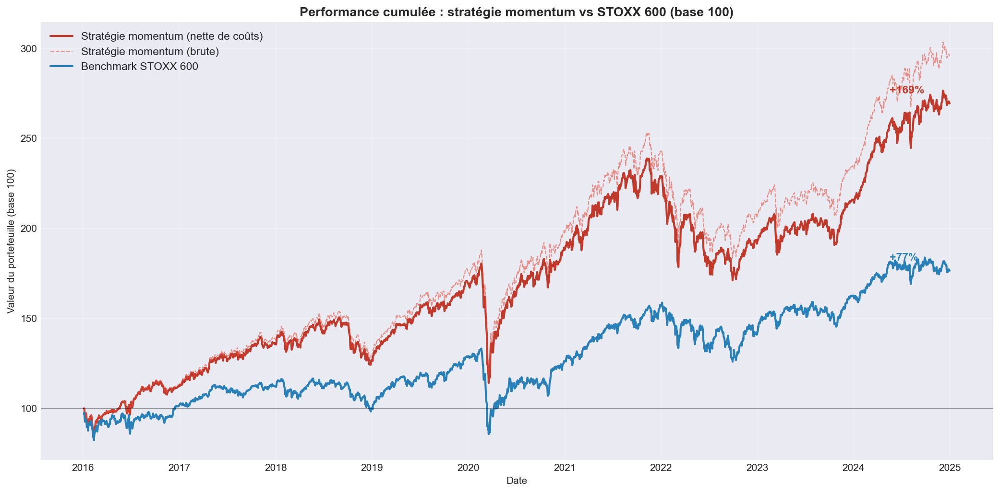
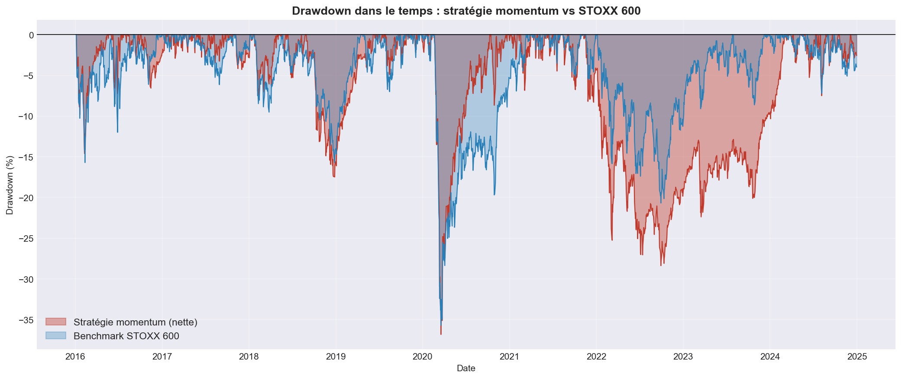
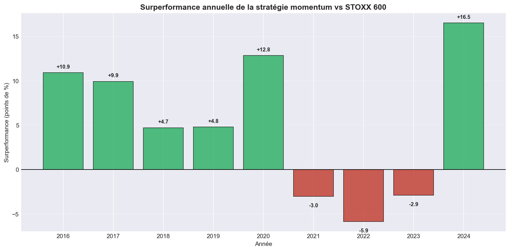
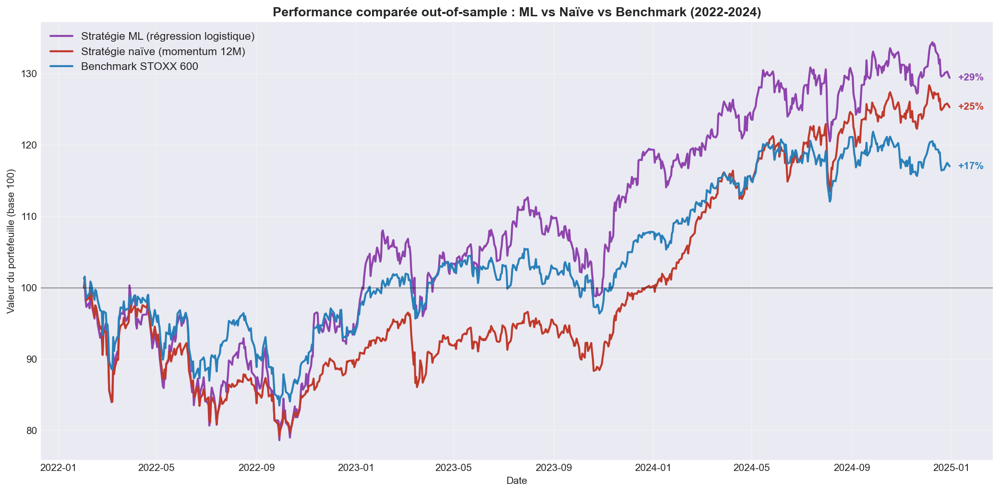

# Stratégie quantitative momentum sur le STOXX Europe 600

> Backtesting d'une stratégie d'investissement factorielle momentum sur l'univers STOXX Europe 600 (2016-2024), avec analyse de robustesse, comparaison au facteur académique et extension par apprentissage automatique.


---

## Problématique

Une stratégie quantitative simple, fondée sur le facteur momentum (acheter les titres ayant le mieux performé sur les douze derniers mois), peut-elle générer un rendement ajusté du risque supérieur au marché européen, après prise en compte des coûts de transaction ?

Ce projet construit un backtest complet « from scratch » (sans framework dédié), teste sa robustesse, valide sa nature factorielle, puis explore si une approche par apprentissage automatique peut faire mieux qu'une règle simple.

## Résultats principaux

> **Sur 2016-2024, la stratégie momentum (long-only, top quintile, rebalancement mensuel) génère un rendement annualisé net de 11,3 %, contre 6,5 % pour le STOXX 600, à volatilité quasi identique.** Le ratio de Sharpe (0,75 contre 0,47) confirme une surperformance ajustée du risque, robuste au choix de la fenêtre de calcul.

| Métrique (2016-2024, net de coûts) | Momentum | STOXX 600 |
|---|---|---|
| Rendement annualisé | 11,34 % | 6,46 % |
| Volatilité annualisée | 16,10 % | 16,24 % |
| Ratio de Sharpe | 0,749 | 0,467 |
| Maximum drawdown | −36,8 % | −35,7 % |
| Rendement total | +169 % | +77 % |

Une réserve méthodologique importante (biais de survie) est documentée plus bas et nuance l'ampleur de cette surperformance.

---

## Données

| Donnée | Source | Détail |
|---|---|---|
| Univers STOXX Europe 600 | iShares ETF (BlackRock) | 603 titres → 577 retenus après nettoyage |
| Cours quotidiens ajustés | Yahoo Finance (yfinance) | 2015-2024, dividendes réinvestis |
| Benchmark STOXX 600 | ETF iShares (EXSA.DE) | Total return |
| Facteur momentum WML | Ken French Data Library | Momentum européen académique |

**Période d'étude** : signal calculé à partir de 2015, backtest sur 2016-2024 (le temps de disposer de 12 mois d'historique pour le premier signal).

### Traitement de la qualité des données

À partir des 603 titres de la composition initiale : 602 téléchargés avec succès, 10 titres britanniques récupérés après correction du format de ticker (double point : `BP..L` → `BP.L`), 13 titres écartés (introuvables ou absorbés, comme Credit Suisse), 12 titres écartés pour historique insuffisant (IPO récentes). **Univers final : 577 titres.**

---

## Méthodologie

### Construction du signal (notebook 02)

Signal momentum **12-1** suivant la convention de Jegadeesh & Titman (1993) : rendement sur les 12 derniers mois en excluant le dernier mois (fenêtre [-252, -21] jours), afin d'éviter la contamination par la réversion à court terme.

- Univers classé en quintiles à chaque fin de mois
- Sélection du top quintile (20 % des meilleurs)
- Pondération equal-weight, long-only
- Rebalancement mensuel

### Prévention des biais

- **Look-ahead bias** : les poids calculés à une date de rebalancement ne sont appliqués qu'à partir du jour de bourse suivant ; les rendements du jour t sont multipliés par les poids de la veille.
- **Data snooping** : la stratégie est testée sur trois fenêtres (3M, 6M, 12M) pour vérifier que le résultat ne dépend pas d'un paramètre optimisé a posteriori.

### Coûts de transaction

Coût de 15 points de base par trade (achat et vente), appliqué au turnover à chaque rebalancement. Turnover annualisé de 351 %, soit un coût de 1,14 point de rendement par an.

---

## 📈 Résultats détaillés

### Performance cumulée



La stratégie se détache du benchmark dès 2016 et creuse l'écart de façon continue. Le décrochage de mars 2020 illustre le « momentum crash » documenté par Daniel & Moskowitz (2016), suivi d'une récupération rapide.

### Profil de risque (drawdown)



Deux régimes de risque distincts : un crash bref mais profond en mars 2020 (−37 %), et un drawdown prolongé en 2022-2023 lié à la rotation de marché provoquée par le resserrement monétaire.

### Robustesse à la fenêtre de calcul

| Fenêtre | Rendement annualisé | Sharpe |
|---|---|---|
| 3 mois | 9,10 % | 0,621 |
| 6 mois | 11,81 % | 0,774 |
| 12 mois | 11,34 % | 0,749 |
| Benchmark | 6,46 % | 0,467 |

Les trois fenêtres battent le marché, avec une hiérarchie conforme à la littérature (les fenêtres moyennes dominent la fenêtre courte, plus proche de la zone de réversion). La surperformance ne dépend donc pas d'un choix de paramètre arbitraire.

### Validation factorielle (notebook 04)

Une régression des rendements de la stratégie sur le marché et le facteur WML de Ken French révèle une exposition significative au momentum (beta WML = 0,47, p < 0,001) une fois le risque de marché neutralisé. L'alpha résiduel n'étant pas significatif, la surperformance s'explique entièrement par l'exposition au facteur momentum : la stratégie capture bien le phénomène académique reconnu.

### Régularité de la performance



La stratégie bat le marché 6 années sur 9. Ses sous-performances sont concentrées sur 2021-2023, période de rotation de marché — comportement caractéristique du momentum lors des retournements de régime.

---

## 🤖 Extension Machine Learning (notebook 05)

Au-delà de la règle fixe, un modèle d'apprentissage est entraîné à prédire les titres surperformants à partir de plusieurs features (momentum 3M/6M/12M, volatilité, réversion court terme).

### Méthodologie rigoureuse

- **Split temporel strict** : entraînement 2016-2021, test out-of-sample 2022-2024 (jamais de mélange aléatoire)
- **Pas de data leakage** : features sans look-ahead, standardisation ajustée sur le seul train
- **Comparaison à une baseline** : la stratégie ML est évaluée contre la règle naïve, à méthodologie identique

### Résultats



| Métrique (test 2022-2024) | ML | Naïve | Benchmark |
|---|---|---|---|
| Rendement annualisé | 9,08 % | 7,90 % | 5,46 % |
| Volatilité annualisée | 20,07 % | 15,16 % | 14,20 % |
| Ratio de Sharpe | 0,533 | 0,577 | 0,446 |

La régression logistique et le Random Forest atteignent un AUC-ROC quasi identique (0,576 et 0,580), signal réel mais modeste et essentiellement linéaire. Les deux modèles identifient la volatilité comme feature dominante sur la période.

**Enseignement clé** : le modèle ML génère un rendement supérieur mais au prix d'une volatilité nettement plus élevée, si bien que son ratio de Sharpe est légèrement inférieur à la règle naïve. La sophistication ne se traduit pas mécaniquement en meilleure performance ajustée du risque — une règle simple et robuste reste une référence difficile à battre.

---

## Limites et extensions

### Limite majeure : le biais de survie

L'univers d'investissement repose sur la composition de l'indice en 2026. Les titres sortis de l'indice avant cette date (faillites, délistages, exclusions) ne sont pas inclus. La stratégie momentum sélectionnant les titres gagnants, et les survivants étant surreprésentés parmi ceux-ci, une part de la surperformance est imputable à ce biais plutôt qu'au seul signal momentum. La littérature estime ce biais entre 1 et 4 points de rendement annualisé. Une analyse sans biais nécessiterait la composition historique mensuelle de l'indice (disponible via Bloomberg).

### Extensions possibles

- **Composition historique** (Bloomberg `MEMB`) pour éliminer le biais de survie
- **Stratégie long-short** (acheter les gagnants, vendre les perdants) pour neutraliser le risque de marché
- **Filtre de régime de marché** pour réduire l'exposition lors des rotations
- **Walk-forward validation** pour le modèle ML (ré-entraînement périodique)
- **Contrainte de volatilité** sur le modèle ML pour améliorer son Sharpe

---

## 🛠 Stack technique

| Outil | Usage |
|---|---|
| **Python 3.12** | Langage principal |
| **pandas, numpy** | Manipulation des données |
| **yfinance** | Cours boursiers |
| **matplotlib** | Visualisations |
| **statsmodels** | Régression factorielle (WML) |
| **scikit-learn** | Modèles ML (régression logistique, Random Forest) |
| **Jupyter Notebook** | Environnement d'analyse |

---

## 📁 Structure du projet

```
momentum-strategy-stoxx600/
├── data/
│   ├── raw/                          # Données brutes
│   │   ├── stoxx600_constituents.csv
│   │   ├── prices_raw.csv
│   │   ├── benchmark_stoxx600.csv
│   │   └── Europe_MOM_Factor_Daily.csv
│   └── processed/                    # Données traitées
│       ├── prices_clean.csv
│       ├── weights_momentum.csv
│       ├── momentum_signals.csv
│       ├── returns_daily.csv
│       └── wml_factor.csv
├── notebooks/
│   ├── 01_data_collection.ipynb      # Univers, benchmark, facteur WML
│   ├── 02_signal_construction.ipynb  # Signal momentum, quintiles, poids
│   ├── 03_backtest.ipynb             # Performance, coûts, métriques de risque
│   ├── 04_performance_analysis.ipynb # WML, robustesse, décomposition annuelle
│   └── 05_ml_extension.ipynb         # Modèles ML vs règle naïve
├── output/
│   ├── figures/                      # Graphiques exportés
│   └── tables/                       # Tableaux de résultats
├── requirements.txt
└── README.md
```

---

## Reproductibilité

```bash
git clone https://github.com/Volkan9117/momentum-strategy-stoxx600.git
cd momentum-strategy-stoxx600

python -m venv venv
.\venv\Scripts\activate          # Windows
# source venv/bin/activate       # macOS/Linux

pip install -r requirements.txt
jupyter notebook
```

Exécuter les notebooks dans l'ordre `01 → 02 → 03 → 04 → 05`.

---

## Auteur

**ISLEYEN Volkan**

L3 Économie-Gestion — Université Grenoble Alpes
— Erasmus Université du Luxembourg

Profil orienté **finance de marché / quant**.

📧 [volkanisleyen12@gmail.com]
🔗 [LinkedIn](linkedin.com/in/volkan-isleyen-60584038a)

---

## Références

- **Jegadeesh, N., & Titman, S. (1993).** *Returns to Buying Winners and Selling Losers: Implications for Stock Market Efficiency.* Journal of Finance, 48(1), 65-91.
- **Carhart, M. M. (1997).** *On Persistence in Mutual Fund Performance.* Journal of Finance, 52(1), 57-82.
- **Daniel, K., & Moskowitz, T. J. (2016).** *Momentum Crashes.* Journal of Financial Economics, 122(2), 221-247.

---

*Projet personnel d'analyse quantitative réalisé en 2026. Toutes les données utilisées sont publiques ou accessibles gratuitement. Les résultats sont fournis à titre illustratif et ne constituent pas un conseil en investissement.*
